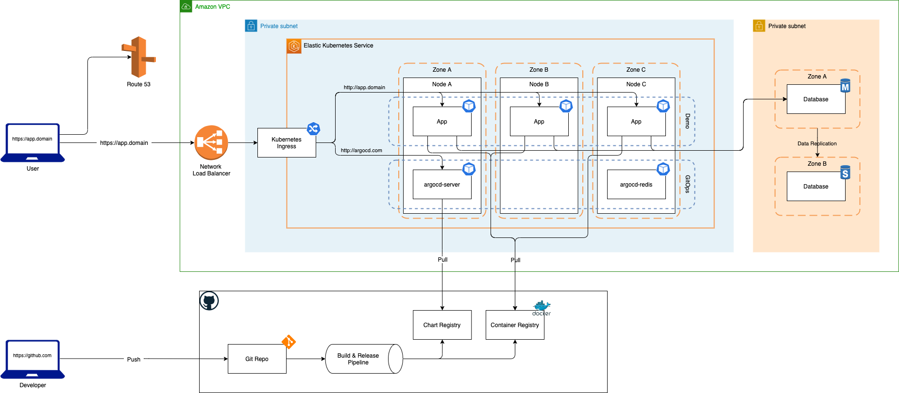

# python-webservice-demo

[](https://github.com/pre-commit/pre-commit)
[](https://github.com/psf/black)

## Application

Given application implements simple REST API written in Python with a help of the Flask framework.

### List of APIs

- |              |                                                                       |
  | ------------ | --------------------------------------------------------------------- |
  | Description: | Saves/updates the given user's name and date of birth in the database |
  | Request:     | `PUT /hello/<username> { "dateOfBirth": "YYYY-MM-DD" }`               |
  | Response:    | `204 No Content`                                                      |

  Notes:

  - `<username>` must contain only letters
  - `YYYY-MM-DD` must be a date before the today date

- |              |                                                   |
  | ------------ | ------------------------------------------------- |
  | Description: | Returns hello birthday message for the given user |
  | Request:     | `GET /hello/<username>`                           |
  | Response:    | `200 OK`                                          |

  Response Examples:

  - If username's birthday is in N days:

    ```json
    { "message": "Hello, <username>! Your birthday is in N day(s)" }
    ```

  - If username's birthday is today:

    ```json
    { "message": "Hello, <username>! Happy birthday!" }
    ```

- |             |                                                      |
  | ----------- | ---------------------------------------------------- |
  | Descrition: | Returns current application based on DB availability |
  | Request:    | `GET /status`                                        |
  | Response:   | `200 OK`                                             |

  Response Examples:

  - Successful response:

    ```json
    { "status": "OK" }
    ```

  - Failed response:

    ```json
    { "status": "DB connection error", "error": "Can't connect to MySQL database" }
    ```

## Development

Development lifecycle implies
[Git Feature Branch Workflow](https://www.atlassian.com/git/tutorials/comparing-workflows/feature-branch-workflow).

On commit to the repository [GitHub Action wokflow](.github/workflows/pre-commit.yaml) will be triggered and will
execute basic code checks and python unit tests with a help of `pre-commit`

On merge to the `main` branch [GitHub Action wokflow](.github/workflows/release.yaml), apart from `pre-commit` checks,
will build and publish Container image and Helm chart artifacts to GitHub Container registry and Packages respectively.

## Local environment

### Docker

To build image locally:

```shell
task docker-build
```

You can instantiate docker image without `docker-compose`. In such case, if no extra arguments passed, application will
use `sqlite` for storage backend. To do so, execute:

```shell
task docker-run
```

### Docker Compose

Docker Compose can be used to bring up a simple `DEV` environment comprised of application and mysql database.

Before the first execution, create a `.env` file in the `/app` folder with the default configuration. You can do it by
copying the `.env.example` file or by running

```shell
task compose-setup
```

Bring environment up:

```shell
task compose-up
```

Bring environment down:

```shell
task compose-down
```

### Minikube

Minikube mimics a production-like setup. It is configured to provision ArgoCD for application delivery, Bitnami MySQL
Helm chart as a storage layer and the application itself. App Helm chart configuration enables a `RollingUpdate`
deployment strategy that allows for zero-downtime deployment.

Bring environment up:

```shell
task minikube-up
```

Bring environment down:

```shell
task minikube-down
```

## AWS deployment diagram



## Usage

This repo uses [Task](https://taskfile.dev/) to help with daily routine tasks. Run `task -l` to see available options:

```shell
$ task -l
task: Available tasks for this project:
* compose-down:        docker-compose down
* compose-logs:        docker-compose logs
* compose-setup:       Setup Docker Compose environment
* compose-up:          docker-compose up
* docker-build:        Build Docker Image
* docker-run:          Run Docker container
* minikube-down:       Delete minikube cluster
* minikube-up:         Bootstrap minikube cluster
* precommit:           Execute pre-commit for modified files
* precommit-all:       Execute pre-commit for all files
* setup:               Setup pre-commit
* unittest:            Run application unit tests
```

## Contribution

To ensure consistency and code quality across the repository we use:

- [markdownlint](https://github.com/DavidAnson/markdownlint)
- [pre-commit](https://pre-commit.com)
- [shellcheck](https://www.shellcheck.net/)
- [yamllint](https://yamllint.readthedocs.io/en/stable)
- [Black style](https://github.com/psf/black)

For local development you will need following tools:

- [Docker](https://www.docker.com)
- [minikube](https://minikube.sigs.k8s.io/docs/start/)
- [Task](https://taskfile.dev)

Dependency tracking and management handled by [Renovate](https://github.com/apps/renovate). It is configured with
following backends:

1. docker-compose
1. dockerfile
1. github-actions
1. helm-values
1. helm-charts
1. kubernetes
1. pip-requirements
1. pre-commit

## TODO

- [ ] Check version bump in `/app/VERSION`
- [ ] Improve documentation
